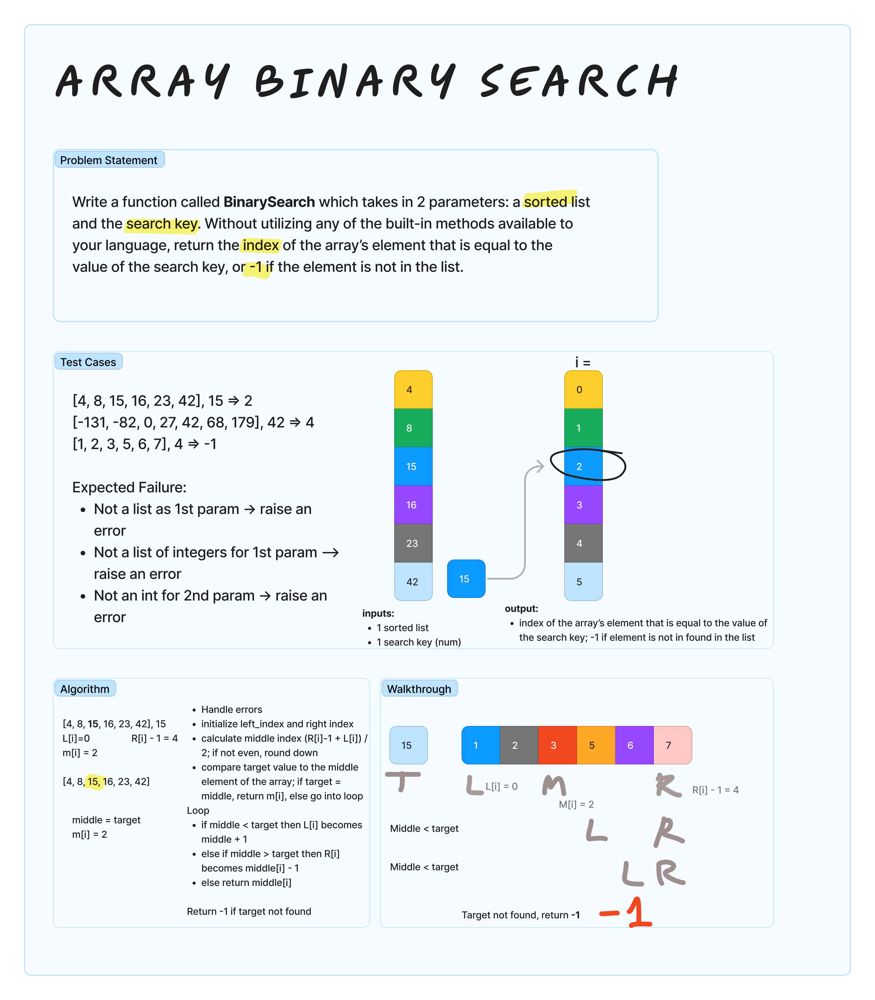

# Array Binary Search
<!-- Description of the challenge -->
Write a function called BinarySearch which takes in 2 parameters: a sorted array and the search key. Without utilizing any of the built-in methods available to your language, return the index of the array’s element that is equal to the value of the search key, or -1 if the element is not in the array.

## Examples

Input: `[4, 8, 15, 16, 23, 42], 15`
Output: `2`

Input: `[-131, -82, 0, 27, 42, 68, 179], 42`
Output: `4`

Input: `[1, 2, 3, 5, 6, 7], 4`
Output: `-1`

## Whiteboard Process
<!-- Embedded whiteboard image -->

## Approach & Efficiency
<!-- What approach did you take? Why? What is the Big O space/time for this approach? -->
I developed the algorithm to utilize the left, right and middle indices. It compares the target value to the middle element of the array. It then iterates and compares the middle value to the target value, adjusting the left index and right index based on if the target value is greater than or less than the index. If the search is unsuccessful, it returns -1.
