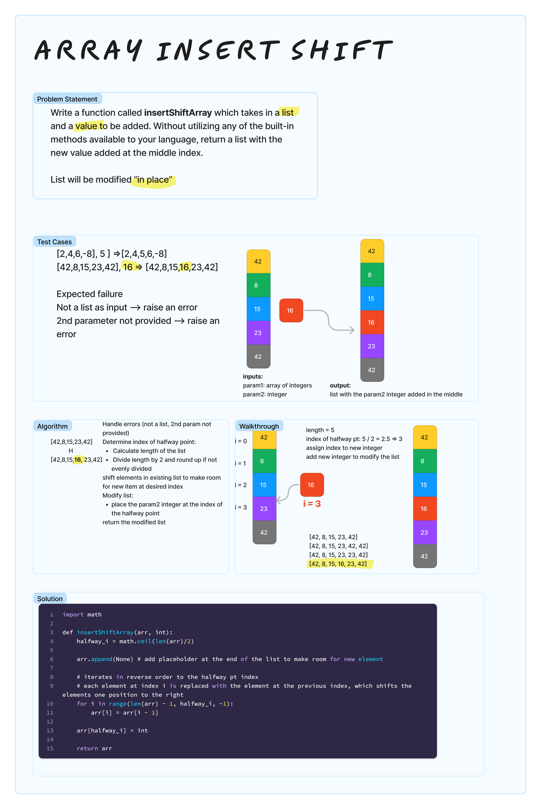

# Array Insert Shift
<!-- Description of the challenge -->
Write a function called insertShiftArray which takes in an array and a value to be added. Without utilizing any of the built-in methods available to your language, return an array with the new value added at the middle index.

## Examples

Input: `[2,4,6,-8], 5`
Output: `[2,4,5,6,-8]`

Input: `[42,8,15,23,42], 16`
Output: `[42,8,15,16,23,42]`

## Whiteboard Process
<!-- Embedded whiteboard image -->


## Approach & Efficiency
<!-- What approach did you take? Why? What is the Big O space/time for this approach? -->

To avoid using built-ins, I used a `for loop` that iterates over the array that is now 1 element longer than the original. This loop utilizes the `range()` method to iterate over a range of indices in reverse order, generating a sequence of indices starting from the last index of the list and going towards the halfway index.

## Solution
<!-- Show how to run your code, and examples of it in action -->

```python
import math

def insertShiftArray(arr, int):
    halfway_i = math.ceil(len(arr)/2)

    arr.append(None) # add placeholder at the end of the list to make room for new element

    # iterates in reverse order to the halfway pt index
    # each element at index i is replaced with the element at the previous index, which shifts the elements one position to the right
    for i in range(len(arr) - 1, halfway_i, -1):
        arr[i] = arr[i - 1]

    arr[halfway_i] = int

    return arr

print(insertShiftArray([42,8,15,23,42], 16))
# [42, 8, 15, 23, 42]
# [42, 8, 15, 23, 42, 42]
# [42, 8, 15, 23, 23, 42]
# [42, 8, 15, 16, 23, 42]
```
