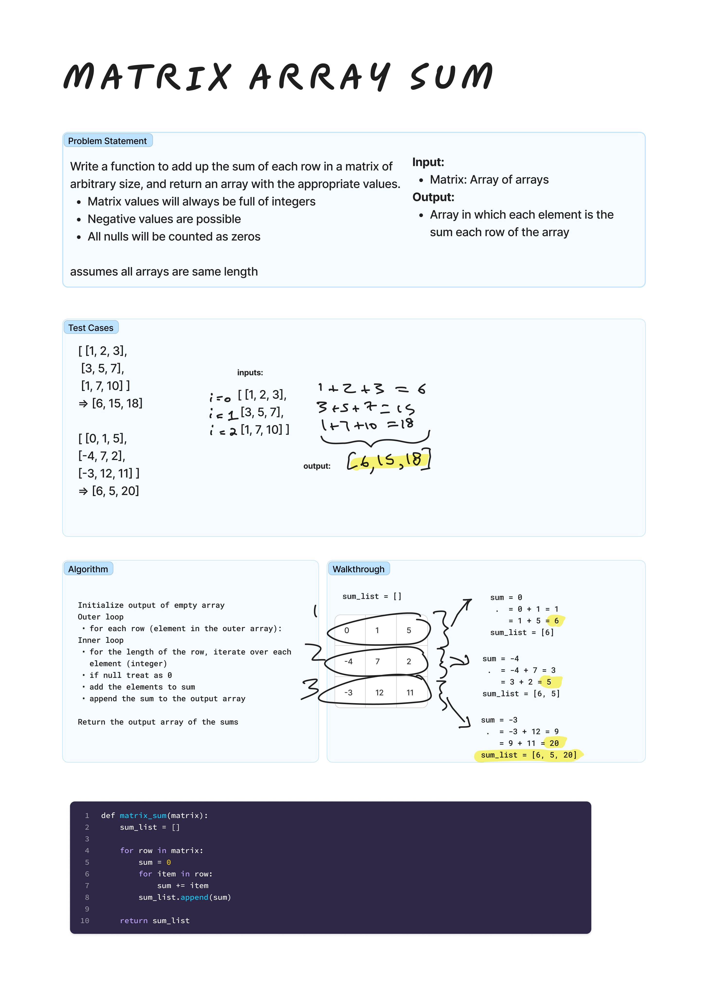

# Array Matrix Sum
<!-- Description of the challenge -->
Write a function to add up the sum of each row in a matrix of arbitrary size, and return an array with the appropriate values. Matrix values will always be full of integers
Negative values are possible
All nulls will be counted as zeros

Assumes all arrays are same length.

## Examples

Input: `[ [1, 2, 3], [3, 5, 7], [1, 7, 10] ]`
Output: `[6, 15, 18]`

Input: `[ [0, 1, 5], [-4, 7, 2], [-3, 12, 11] ]`
Output: `[6, 5, 20]`

## Whiteboard Process
<!-- Embedded whiteboard image -->


## Approach & Efficiency
<!-- What approach did you take? Why? What is the Big O space/time for this approach? -->
I developed the algorithm to utilizes nested for loops. The first loop iterates over the rows while the inner loop iterates over the items in the row and keeps a running total. Once it reaches the end of the row, it appends this number to the `sum_list` output.

## Solution

```python
def matrix_sum(matrix):
    sum_list = []

    for row in matrix:
        sum = 0
        for item in row:
            sum += item
        sum_list.append(sum)

    return sum_list
```
