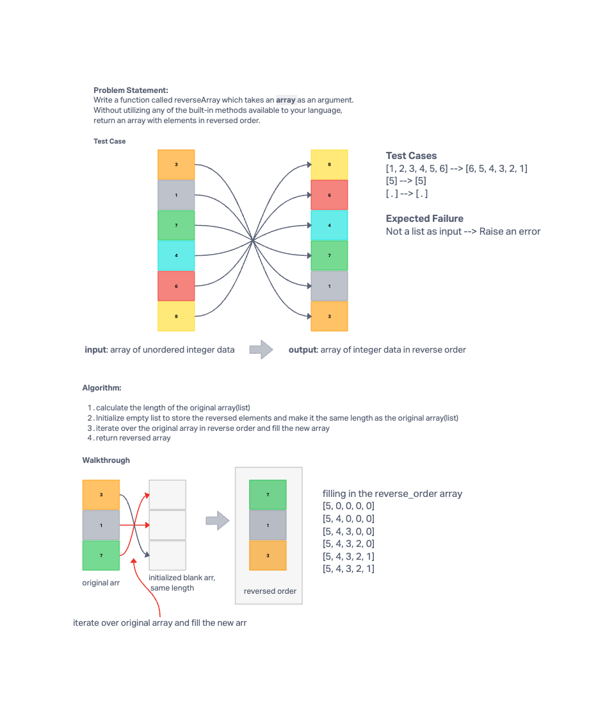

# Array Reverse
<!-- Description of the challenge -->
Write a function called reverseArray which takes an array as an argument. Without utilizing any of the built-in methods available to your language, return an array with elements in reversed order.

Utilize the Single-responsibility principle: any methods you write should be clean, reusable, abstract component parts to the whole challenge.

## Examples

Input: [1, 2, 3, 4, 5, 6]
Output: [6, 5, 4, 3, 2, 1]

Input: [89, 2354, 3546, 23, 10, -923, 823, -12]
Output: [-12, 823, -923, 10, 23, 3546, 2354, 89]

## Whiteboard Process
<!-- Embedded whiteboard image -->


## Approach & Efficiency
<!-- What approach did you take? Why? What is the Big O space/time for this approach? -->

To avoid using built-ins, I used a `while loop` that iterates over a newly created array that is the the same length of the original array. This loop starts at the last element in the array `arr[length - 1 - i]` by calculating the index in reverse order.

## Solution
<!-- Show how to run your code, and examples of it in action -->

[array_reverse.py](../../code_challenges/array_reverse.py)

```python
def reverseArray(arr):
    # calculate length of the original array
    length = len(arr)
    # initialize empty list to store the reversed elements (same length of the original array)
    reversed_arr = [0] * length

    # initialize index
    i = 0

    # iterate over the original array in reverse order and fill the new array

    while i < length:
        reversed_arr[i] = arr[length - 1 - i]
        i += 1

    return reversed_arr

print(reverseArray([1, 2, 3, 4, 5]))
# filling in the reverse_order array
# [5, 0, 0, 0, 0]
# [5, 4, 0, 0, 0]
# [5, 4, 3, 0, 0]
# [5, 4, 3, 2, 0]
# [5, 4, 3, 2, 1]
# [5, 4, 3, 2, 1]
# output: [5, 4, 3, 2, 1]

```
