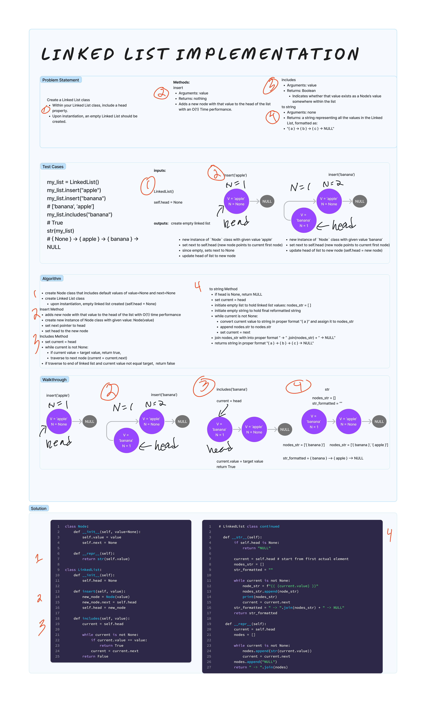

# Linked List
<!-- Description of the challenge -->
Create a Linked List class. Within your Linked List class, include a head property. Upon instantiation, an empty Linked List should be created.

Include the following methods: `insert`, `includes`, `to string`

`insert`

- Arguments: value
- Returns: nothing
- Adds a new node with that value to the `head` of the list with an O(1) Time performance.

`includes`

- Arguments: value
- Returns: Boolean
  - Indicates whether that value exists as a Node’s value somewhere within the list.

`to string`

- Arguments: none
- Returns: a string representing all the values in the Linked List, formatted as: `"{ a } -> { b } -> { c } -> NULL"`

## Examples

```python
my_list = LinkedList()
my_list.insert("apple")
my_list.insert("banana")

# ['banana', 'apple']

my_list.includes("banana")
# True

str(my_list)
# { banana } -> { apple } -> NULL

```

## Whiteboard Process
<!-- Embedded whiteboard image -->


## Approach & Efficiency

I created a Node class to serve as blueprint for new node creation. I then created a LinkedList class that would create an empty linked list upon instantiation. Adding the `insert` method involved creating new instance of Node class with given value, and setting next to the head to link it to the end of the linked list. This method adds a new node with that value to the `head` of the list with an O(1) Time performance, since it will always take the same number of steps.

## Solution

[linked_list.py](../../data_structures/linked_list.py)

```python
class Node:
    def __init__(self, value=None):
        self.value = value
        self.next = None

    def __repr__(self):
        return str(self.value)

class LinkedList:
    def __init__(self):
        self.head = None

    def insert(self, value):
        new_node = Node(value)
        new_node.next = self.head
        self.head = new_node

    def includes(self, value):
        current = self.head

        while current is not None:
            if current.value == value:
                return True
            current = current.next
        return False

    def display(self):
        if self.head is None:
            return "NULL"

        current = self.head
        nodes = []
        while current is not None:
            nodes.append(current.value)
            current = current.next
        print(nodes)


    def __str__(self):
        if self.head is None:
            return "NULL"

        current = self.head # start from first actual element
        nodes_str = []
        str_formatted = ""

        while current is not None:
            node_str = f"{{ {current.value} }}"
            nodes_str.append(node_str)
            print(nodes_str)
            current = current.next
        str_formatted = " -> ".join(nodes_str) + " -> NULL"
        return str_formatted

    def __repr__(self):
        current = self.head
        nodes = []

        while current is not None:
            nodes.append(str(current.value))
            current = current.next
        nodes.append("NULL")
        return " -> ".join(nodes)
```
