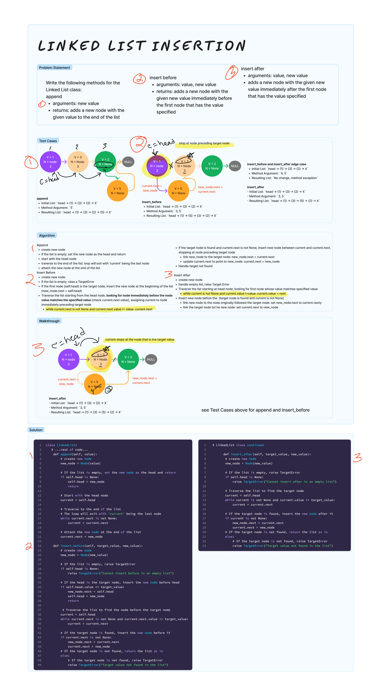

# Linked List Insertions
<!-- Description of the challenge -->
Add the following methods to the LinkedList class: `append`, `insert before`, `insert after`

`append`

- arguments: new value
- adds a new node with the given value to the end of the list

`insert before`

- arguments: value, new value
- adds a new node with the given new value immediately before the first node that has the value specified

`insert after`

- arguments: value, new value
- adds a new node with the given new value immediately after the first node that has the value specified

## Examples

### `Append`

- Initial List: `head -> {1} -> {3} -> {2} -> X`
- Method Argument: `5`
- Resulting List: `head -> {1} -> {3} -> {2} -> {5} -> X`

- Initial List: `head -> X`
- Method Argument: `1`
- Resulting List: `head -> {1} -> X`

### `Insert Before`

- Initial List: `head -> {1} -> {3} -> {2} -> X`
- Method Argument: `3, 5`
- Resulting List: `head -> {1} -> {5} -> {3} -> {2} -> X`

- Initial List: `head -> {1} -> {3} -> {2} -> X`
- Method Argument: `4, 5`
- Resulting List: `No change, method exception`

### `Insert After`

- Initial List: `head -> {1} -> {3} -> {2} -> X`
- Method Argument: `3, 5`
- Resulting List: `head -> {1} -> {3} -> {5} -> {2} -> X`

- Initial List: `head -> {1} -> {3} -> {2} -> X`
- Method Argument: `4, 5`
- Resulting List: `No change, method exception`

## Whiteboard Process
<!-- Embedded whiteboard image -->


## Approach & Efficiency

- `append` method has time complexity of O(n)
- `insert_before` method has time complexity of O(n)
- `insert_after`method has time complexity of O(n)

In the worst case, this method traverses the list until it finds the target value or reaches the end of the list. The time taken depends on the position of the target node or the size of the list if the target is not found, resulting in a linear time complexity.

## Solution

[linked_list.py](../../data_structures/linked_list.py)

```python
class LinkedList:

    def __init__(self):
        self.head = None

    ....other methods

    def append(self, value):
        # create new node
        new_node = Node(value)

        # If the list is empty, set the new node as the head and return
        if self.head is None:
            self.head = new_node
            return

        # Start with the head node
        current = self.head

        # Traverse to the end of the list
        # The loop will exit with 'current' being the last node
        while current.next is not None:
            current = current.next

        # Attach the new node at the end of the list
        current.next = new_node

    def insert_before(self, value, new_value):
        # create new node
        new_node = Node(new_value)

        # If the list is empty, raise TargetError
        if self.head is None:
            raise TargetError("Cannot insert before in an empty list")

        # If the head is the target node, insert the new node before head
        if self.head.value == value:
            new_node.next = self.head
            self.head = new_node
            return

         # Traverse the list to find the node before the target node
        current = self.head
        while current.next is not None and current.next.value != value:
            current = current.next

        # If the target node is found, insert the new node before it
        if current.next is not None:
            new_node.next = current.next
            current.next = new_node
        # If the target node is not found, return the list as is
        else:
            # If the target node is not found, raise TargetError
            raise TargetError("Target value not found in the list")

    def insert_after(self, value, new_value):
        # create new node
        new_node = Node(new_value)

        # If the list is empty, raise TargetError
        if self.head is None:
            raise TargetError("Cannot insert after in an empty list")

        # Traverse the list to find the target node
        current = self.head
        while current is not None and current.value != value:
            current = current.next

        # If the target node is found, insert the new node after it
        if current is not None:
            new_node.next = current.next
            current.next = new_node
        # If the target node is not found, return the list as is
        else:
            # If the target node is not found, raise TargetError
            raise TargetError("Target value not found in the list")
```
