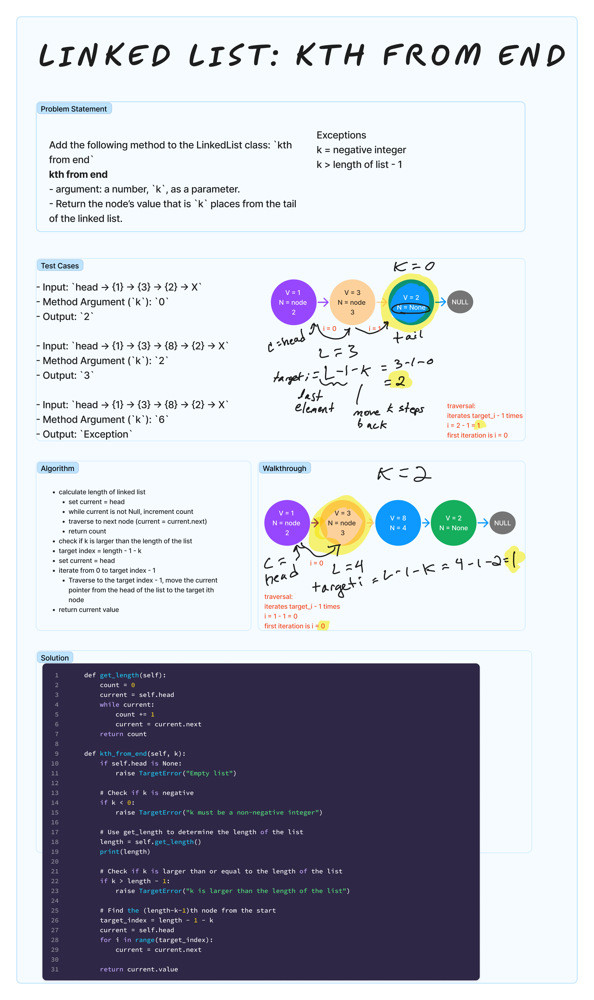

# Linked List kth From End
<!-- Description of the challenge -->
Add the following method to the LinkedList class: `kth from end`

`kth from end`

- argument: a number, `k`, as a parameter.
- Return the node’s value that is `k` places from the tail of the linked list.

## Examples

- Input: `head -> {1} -> {3} -> {2} -> X`
- Method Argument (`k`): `0`
- Output: `2`

- Input: `head -> {1} -> {3} -> {8} -> {2} -> X`
- Method Argument (`k`): `2`
- Output: `3`

- Input: `head -> {1} -> {3} -> {8} -> {2} -> X`
- Method Argument (`k`): `6`
- Output: `Exception`

## Whiteboard Process
<!-- Embedded whiteboard image -->


## Approach & Efficiency

- Time efficiency for `kth_from_end` is O(n), where n is the number of nodes in the linked list
  - Determining the length of the list traverses the list once
  - Finding the kth Node from the End: After finding the length of the list, the method calculates the target index (which is `length - 1 - k`) and then traverses the list again to reach this node.
  - These happen sequentially, so overall time complexity is O(n)
- Method has a linear time complexity relative to the size of the linked list, as the entire list may need to be traversed twice in the worst-case scenario.

## Solution

[linked_list.py](../../data_structures/linked_list.py)

```python
    def get_length(self):
        count = 0
        current = self.head
        while current:
            count += 1
            current = current.next
        return count

    def kth_from_end(self, k):
        if self.head is None:
            raise TargetError("Empty list")

        # Check if k is negative
        if k < 0:
            raise TargetError("k must be a non-negative integer")

        # Use get_length to determine the length of the list
        length = self.get_length()
        print(length)

        # Check if k is larger than or equal to the length of the list
        if k > length - 1:
            raise TargetError("k is larger than the length of the list")

        # Find the (length-k-1)th node from the start
        target_index = length - 1 - k
        current = self.head
        for i in range(target_index):
            current = current.next

        return current.value
```
