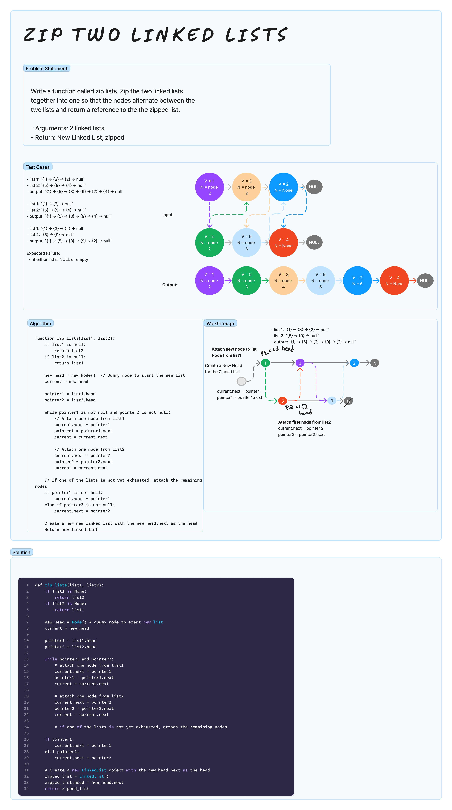

# Linked Lists Zip
<!-- Description of the challenge -->

Write a function called zip lists. Zip the two linked lists together into one so that the nodes alternate between the two lists and return a reference to the the zipped list.

- Arguments: 2 linked lists
- Return: New Linked List, zipped

## Examples

`zipLists(list1, list2)`

- list 1: `{1} -> {3} -> {2} -> null`
- list 2: `{5} -> {9} -> {4} -> null`
- output: `{1} -> {5} -> {3} -> {9} -> {2} -> {4} -> null`

- list 1: `{1} -> {3} -> null`
- list 2: `{5} -> {9} -> {4} -> null`
- output: `{1} -> {5} -> {3} -> {9} -> {4} -> null`

- list 1: `{1} -> {3} -> {2} -> null`
- list 2: `{5} -> {9} -> null`
- output: `{1} -> {5} -> {3} -> {9} -> {2} -> null`


## Whiteboard Process
<!-- Embedded whiteboard image -->


## Approach & Efficiency

Time complexity is O(n), where n is the total number of elements in both linked lists.

The dominant factor in the time complexity is the while loop, which iterates over the elements of the two lists. Hence, the overall time complexity is O(n), where n is the total number of elements in both input lists.

The space complexity is O(1) since the function zips the lists in place without using extra space proportional to the input size (the only extra space used is for a few pointers and the dummy head node).

## Solution

[linked_list.py](../../code_challenges/linked_list_zip.py)

```python
def zip_lists(list1, list2):
    if list1 is None:
        return list2
    if list2 is None:
        return list1

    new_head = Node() # dummy node to start new list
    current = new_head

    pointer1 = list1.head
    pointer2 = list2.head

    while pointer1 and pointer2:
        # attach one node from list1
        current.next = pointer1
        pointer1 = pointer1.next
        current = current.next

        # attach one node from list2
        current.next = pointer2
        pointer2 = pointer2.next
        current = current.next

        # if one of the lists is not yet exhausted, attach the remaining nodes

    if pointer1:
        current.next = pointer1
    elif pointer2:
        current.next = pointer2

    # Create a new LinkedList object with the new_head.next as the head
    zipped_list = LinkedList()
    zipped_list.head = new_head.next
    return zipped_list
```
