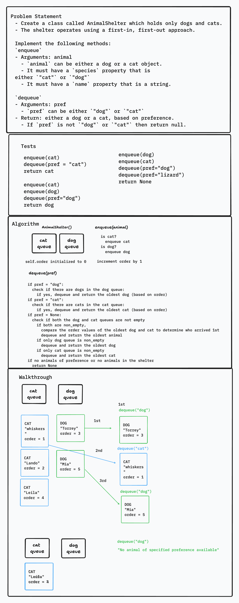

# Stack Queue Animal Shelter
<!-- Description of the challenge -->

- Create a class called AnimalShelter which holds only dogs and cats.
- The shelter operates using a first-in, first-out approach.

Implement the following methods:

`enqueue`

- Arguments: animal
  - `animal` can be either a dog or a cat object.
  - It must have a `species` property that is either `"cat"` or `"dog"`
  - It must have a `name` property that is a string.

`dequeue`

- Arguments: pref
  - `pref` can be either `"dog"` or `"cat"`
- Return: either a dog or a cat, based on preference.
  - If `pref` is not `"dog"` or `"cat"` then return null.

## Examples

See tests on whiteboard

## Whiteboard Process
<!-- Embedded whiteboard image -->


## Approach & Efficiency

- Utilized `Queue` class to instantiate the dog queue and the cat queue and its methods (e.g., `is_empty`, `peek`, `enqueue`)
- `self.order` variable is used to determine the order of arrival of animals and is used to maintain fairness when dequeuing animals based on preference or when no preference is specified. Dogs and cats are dequeued in the order they arrived at the shelter.
- `enqueue` has time efficiency of O(1). Regardless of the number of animals already in the shelter, adding an animal to a queue involves constant-time operations such as appending to a list
- `dequeue` has time efficiency of O(1). Operations involved (e.g., checking if a queue is empty, popping from a list or deque) are constant-time operations.

## Tests

`pytest -k test_stack_queue_animal_shelter.py`

## Run Code

`python3 -m code_challenges.stack_queue_animal_shelter`

## Solution

[stack_queue_animal_shelter.py](../../code_challenges/stack_queue_animal_shelter.py)

```python
class AnimalShelter:
    """
    A class to represent an animal shelter which holds only dogs and cats. The shelter uses a FIFO approach.

    Attributes:
    dog_queue(linked list): stores the dog instances waiting in the shelter.
    cat_queue(linked list): stores the cat instances waiting in the shelter.

    Methods:
    enqueue
    dequeue
    """
    def __init__(self):
        """
        Constructs AnimalShelter object with empty dog_queue and cat_queue upon instantiation.
        """
        self.dog_queue = Queue()
        self.cat_queue = Queue()
        self.order = 0  # To maintain the order of arrival of animals

    def enqueue(self, animal):
        """
        Responsible for adding an animal to the appropriate queue (either the dog queue or the cat queue) while maintaining the order of arrival.
        """
        if isinstance(animal, Dog):
            self.dog_queue.enqueue((animal, self.order))
        elif isinstance(animal, Cat):
            self.cat_queue.enqueue((animal, self.order))
        self.order += 1  # Increment the order when any animal is enqueued

    def dequeue(self, preference=None):
        """
        Dequeues an animal based on a specified preference ("dog" or "cat") or returns the oldest animal if no preference is specified.
        """
        if preference == "dog":
            if not self.dog_queue.is_empty():
                return self.dog_queue.dequeue()[0]
        elif preference == "cat":
            if not self.cat_queue.is_empty():
                return self.cat_queue.dequeue()[0]
        elif preference is None:  # No preference specified, return the oldest animal
            if not self.dog_queue.is_empty() and not self.cat_queue.is_empty():
                if self.dog_queue.peek()[1] < self.cat_queue.peek()[1]:
                    return self.dog_queue.dequeue()[0]
                else:
                    return self.cat_queue.dequeue()[0]
            elif not self.dog_queue.is_empty():
                return self.dog_queue.dequeue()[0]
            elif not self.cat_queue.is_empty():
                return self.cat_queue.dequeue()[0]
        return None  # No animal of the specified preference in the shelter

    def __repr__(self):
        return f"AnimalShelter instance."

class Dog:
    """
    A class to represent a Dog.

    Attributes:
    species(str): type of animal (dog)
    name(str): name of dog
    """
    def __init__(self, species="dog", name="unknown"):
        self.species = species
        self.name = name

    def __repr__(self):
        return f"Dog instance. Name = {self.name}. Species = {self.species}"


class Cat:
    """
    A class to represent a Cat.

    Attributes:
    species(str): type of animal (cat)
    name(str): name of cat
    """
    def __init__(self, species="dog", name="unknown"):
        self.species = species
        self.name = name

    def __repr__(self):
        return f"Cat instance. Name = {self.name}. Species = {self.species}"

```
