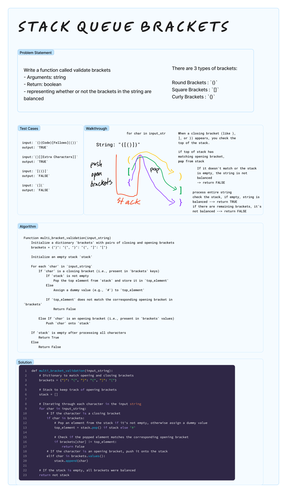

# Stack Queue Brackets
<!-- Description of the challenge -->

Write a function called validate brackets

- Arguments: string
- Return: boolean
  - representing whether or not the brackets in the string are balanced

There are 3 types of brackets:

Round Brackets : `()`
Square Brackets : `[]`
Curly Brackets : `{}`

## Examples

input: `{}{Code}[Fellows](())`
output: `TRUE`

input:`()[[Extra Characters]]`
output: `TRUE`

input: `[({}]`
output: `FALSE`

input: `(](`
output: `FALSE`

## Whiteboard Process
<!-- Embedded whiteboard image -->


## Approach & Efficiency

In the `multi_bracket_validation` function, the dictionary brackets plays a crucial role. This dictionary is used to map each type of closing bracket to its corresponding opening bracket. The dictionary is defined with closing brackets as keys and their corresponding opening brackets as values.

```python

brackets = {")": "(", "}": "{", "]": "["}

# } is the key for {
```

When the function encounters a closing bracket (like `)`, `}`, or `]`), it looks up this bracket in the dictionary to find the matching opening bracket.
The function then checks the top of the stack, which should hold the most recent opening bracket.
If the top of the stack matches the value obtained from the dictionary (i.e., the corresponding opening bracket), it means that the brackets are correctly matched and balanced up to this point, and the function pops this opening bracket off the stack.
If the top of the stack does not match the dictionary value, or if the stack is empty (implying there was no corresponding opening bracket), the function concludes that the brackets are not balanced and returns False.

> Suppose the current state of the stack is `["(", "{"]`, and the next character in the string is `}`.
The function looks up `}` in the brackets dictionary and finds `{`.
It then compares this with the top element of the stack (which is `{`).
Since these match, the function pops `{` off the stack.

## Tests

`pytest -k test_stack_queue_brackets.py`

## Run Code

`python3 -m code_challenges.stack_queue_brackets`

## Solution

[stack_queue_animal_shelter.py](../../code_challenges/stack_queue_brackets.py)

```python
def multi_bracket_validation(input_string):
    # Dictionary to match opening and closing brackets
    brackets = {")": "(", "}": "{", "]": "["}

    # Stack to keep track of opening brackets
    stack = []

    # Iterating through each character in the input string
    for char in input_string:
        # If the character is a closing bracket
        if char in brackets:
            # Pop an element from the stack if it's not empty, otherwise assign a dummy value
            top_element = stack.pop() if stack else '#'

            # Check if the popped element matches the corresponding opening bracket
            if brackets[char] != top_element:
                return False
        # If the character is an opening bracket, push it onto the stack
        elif char in brackets.values():
            stack.append(char)

    # If the stack is empty, all brackets were balanced
    return not stack
```
