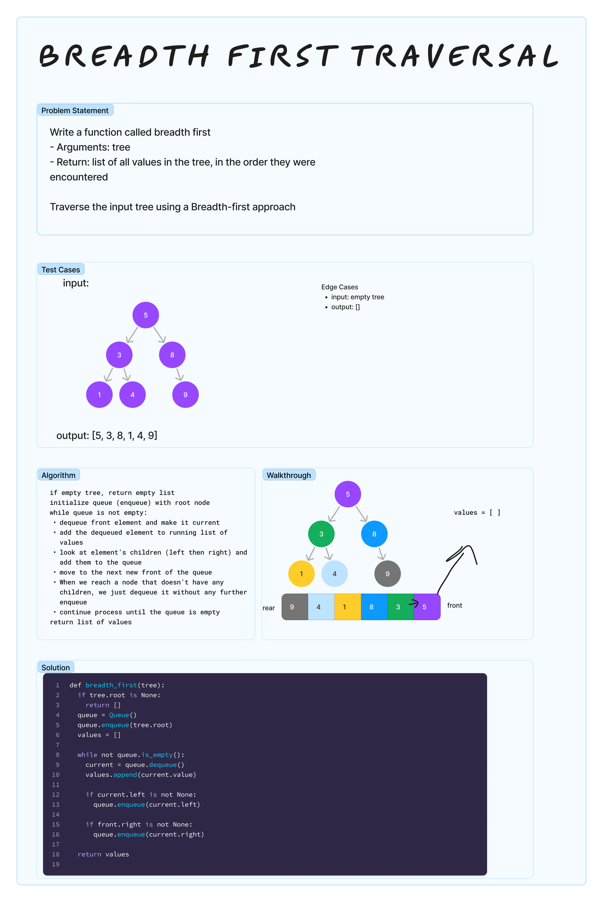

# Binary Tree Breadth First Traversal
<!-- Description of the challenge -->

Write a function called breadth first

- Arguments: tree
- Return: list of all values in the tree, in the order they were encountered

Traverse the input tree using a Breadth-first approach

## Examples

See Whiteboard

## Run Tests

`pytest -k test_tree_breadth_first.py`

## Run Code

`python3 -m code_challenges.tree_breadth_first`

## Whiteboard Process
<!-- Embedded whiteboard image -->


## Approach & Efficiency

### Time Complexity

- The enqueuing and dequeuing operations of a queue are typically O(1) (constant time) operations.
- Therefore, the time complexity of this function is `O(n)`, where n is the number of nodes in the tree.

### Space Complexity

- The space used by the function is primarily for two purposes: the queue and the values list.
- The queue will, in the worst-case scenario (a completely unbalanced tree), contain at most n elements, where n is the number of nodes in the tree. This is because each node is added to the queue.
- The values list will also contain n elements since it stores the value of each node.
- Therefore, the space complexity of this function is also `O(n)`, as the space required is proportional to the number of nodes in the tree.

## Solution

[tree_breadth_first.py](../../code_challenges/tree_breadth_first.py)

```python
def breadth_first(tree):
    """
    Function that performs breadth-first traversal of the tree

    - Arguments: tree
    - Return: list of all values in the tree, in the order they were encountered
    """
    if tree.root is None:
        return []

    queue = Queue()
    queue.enqueue(tree.root)
    values = []

    while not queue.is_empty():
        current = queue.dequeue()
        values.append(current.value)

        if current.left is not None:
            queue.enqueue(current.left)

        if current.right is not None:
            queue.enqueue(current.right)

    return values

```
