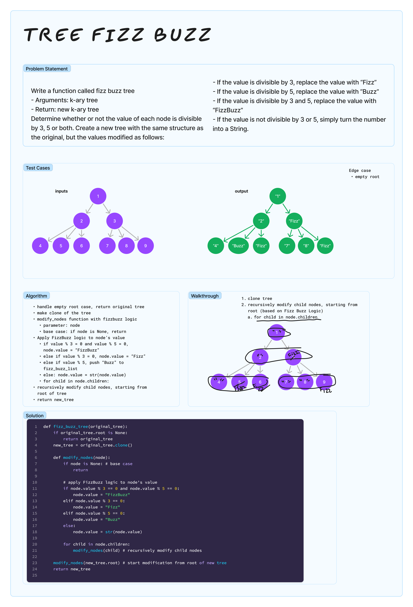

# Tree Fizz Buzz
<!-- Description of the challenge -->

Write a function called fizz buzz tree

- Arguments: k-ary tree
- Return: new k-ary tree

Determine whether or not the value of each node is divisible by 3, 5 or both. Create a new tree with the same structure as the original, but the values modified as follows:

- If the value is divisible by 3, replace the value with “Fizz”
- If the value is divisible by 5, replace the value with “Buzz”
- If the value is divisible by 3 and 5, replace the value with “FizzBuzz”
- If the value is not divisible by 3 or 5, simply turn the number into a String.

## Examples

See Tests and Whiteboard

## Run Tests

`pytest -k test_tree_fizz_buzz.py`

## Run Code

`python3 -m code_challenges.tree_fizz_buzz`

## Whiteboard Process
<!-- Embedded whiteboard image -->


## Approach & Efficiency

- clone tree
- recursively modify child nodes, starting from root (based on FizzBuzz Logic) --> for child in node.children
- Time Complexity: O(n), each node in the tree is visited exactly once, and for each node a constant amount of work is done (checking divisibility and modifying value)
- Space Complexity: O(n)
  - call stack: proportional for height of tree - O(n) for worse case (unbalanced tree). For balanced K-ary tree, height of tree would be O(logkn)
  - storing the new tree: O(n)

## Solution

[tree_fizz_buzz.py](../../code_challenges/tree_fizz_buzz.py)

```python
def fizz_buzz_tree(original_tree):
    if original_tree.root is None:
        return original_tree
    new_tree = original_tree.clone()

    def modify_nodes(node):
        if node is None: # base case
            return

        # apply FizzBuzz logic to node's value
        if node.value % 3 == 0 and node.value % 5 == 0:
            node.value = "FizzBuzz"
        elif node.value % 3 == 0:
            node.value = "Fizz"
        elif node.value % 5 == 0:
            node.value = "Buzz"
        else:
            node.value = str(node.value)

        for child in node.children:
            modify_nodes(child) # recursively modify child nodes

    modify_nodes(new_tree.root) # start modification from root of new tree
    return new_tree
```
