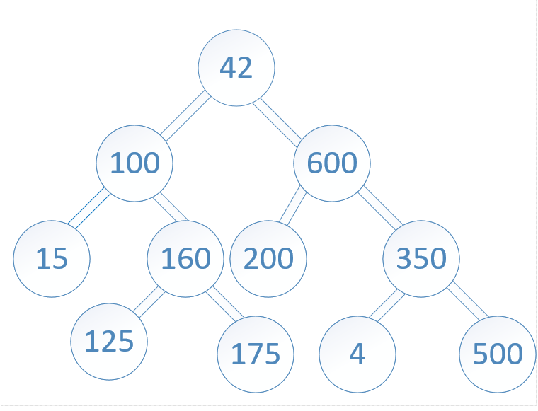

# Tree Intersection
<!-- Description of the challenge -->

Write a function called tree_intersection that takes two binary trees as parameters.

Using your Hashmap implementation as a part of your algorithm, return a set of values found in both trees.

## Examples

Input:

Output:

`100,160,125,175,200,350,500`

## Whiteboard Process

## Approach & Efficiency

### Space Complexity

- `O(n + m)`
- hash table: `O(n)` - n is number of nodes in the 1st tree to store value for each node
- matches set `O(min(n,m))`
- iterarative traversal
  - balanced tree `O(log n) + O(log m)`
  - worst case (highly unbalanced) - `O(n) or O(m)`

### Time Complexity

`O(n + m)` - n and m are numbers of nodes in trees 1 and 2

## Tests

`pytest -k test_tree_intersection.py`

## Run Code

`python3 -m code_challenges.tree_intersection`

## Solution

[hashtable.py](../../code_challenges/tree_intersection.py)
