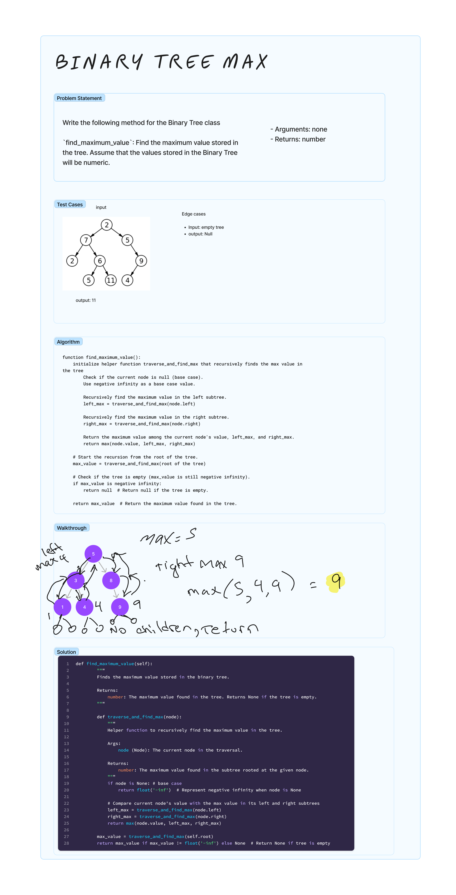

# Binary Tree Max
<!-- Description of the challenge -->

Write the following method for the Binary Tree class

`find_maximum_value`: Find the maximum value stored in the tree. Assume that the values stored in the Binary Tree will be numeric.

- Arguments: none
- Returns: number

## Examples

See Whiteboard

## Run Tests

`pytest -k test_tree_max.py`

## Whiteboard Process
<!-- Embedded whiteboard image -->


## Approach & Efficiency

Time complexity is O(n) and the space complexity is O(h), where h is the height of the tree and can vary from O(log(n)) for a balanced tree to O(n) in the worst case.

The expression `float('-inf')` in Python is used to represent negative infinity. This is a special value recognized as lower than all other numerical values. It is used in the base case for recursion and in comparison values as the recursion unwinds. Each node's value is compared with the maximum values found in its left and right subtrees. Since float('-inf') is the lowest possible value, any real number in the nodes will be greater than this, ensuring an accurate comparison and proper determination of the maximum value.

By passing `node.value`, `left_max`, and `right_max` to max(), the function is effectively comparing the value of the current node with the maximum values found in its left and right subtrees.

This approach ensures that at each step of the recursion, the function considers the current node's value and the maximum values of its subtrees, thus accurately determining the overall maximum value in the entire binary tree.

## Solution

[binary_tree.py](../../data_structures/binary_tree.py)

```python

def find_maximum_value(self):
        """
        Finds the maximum value stored in the binary tree.

        Returns:
            number: The maximum value found in the tree. Returns None if the tree is empty.
        """

        def traverse_and_find_max(node):
            """
            Helper function to recursively find the maximum value in the tree.

            Args:
                node (Node): The current node in the traversal.

            Returns:
                number: The maximum value found in the subtree rooted at the given node.
            """
            if node is None: # base case
                return float('-inf')  # Represent negative infinity when node is None

            # Compare current node's value with the max value in its left and right subtrees
            left_max = traverse_and_find_max(node.left)
            right_max = traverse_and_find_max(node.right)
            return max(node.value, left_max, right_max)

        max_value = traverse_and_find_max(self.root)
        return max_value if max_value != float('-inf') else None  # Return None if tree is empty

```
